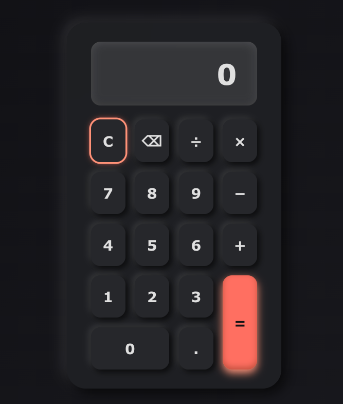

# Calculator Web Application 🧮

This is a simple Calculator web application built using **HTML**, **CSS**, and **JavaScript**.  
It supports basic arithmetic operations and features a clean, responsive design.

## 🌐 Live Demo

The web application is live at:  
🔗 [Calculator Live Demo](https://calculator-selise.vercel.app/)

## 💻 GitHub Repository

You can find the source code here:  
🔗 [GitHub Repository](https://github.com/ZisanSarker/calculator_selise)

## ✨ Features

- Basic arithmetic operations: addition, subtraction, multiplication, division
- Responsive and user-friendly interface
- Real-time calculation display
- Error handling for invalid inputs

## 📸 Screenshot

  
> Make sure to replace `screenshot.png` with your actual screenshot file name if it's different.

## 🚀 Getting Started

To run the project locally:

1. Clone the repository:
   ```bash
   git clone https://github.com/ZisanSarker/calculator_selise.git
   ```
2. Open the `index.html` file in your browser.

## 🛠️ Technologies Used

- HTML
- CSS
- JavaScript

---

Feel free to explore, use, or contribute to the project. Feedback and suggestions are always welcome!
